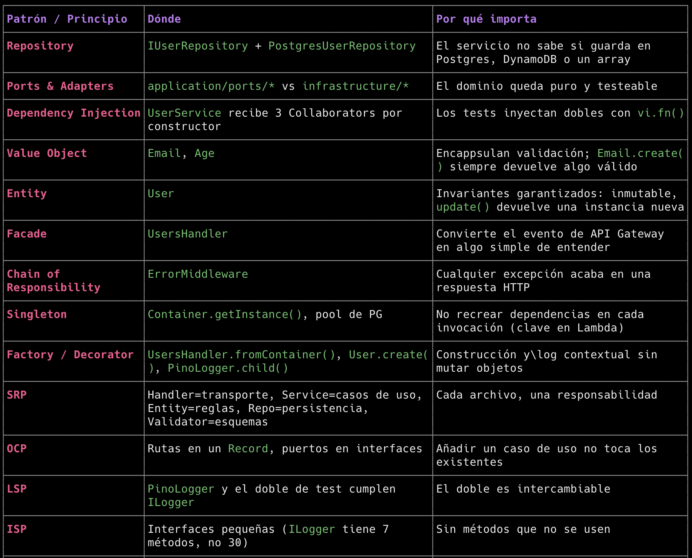
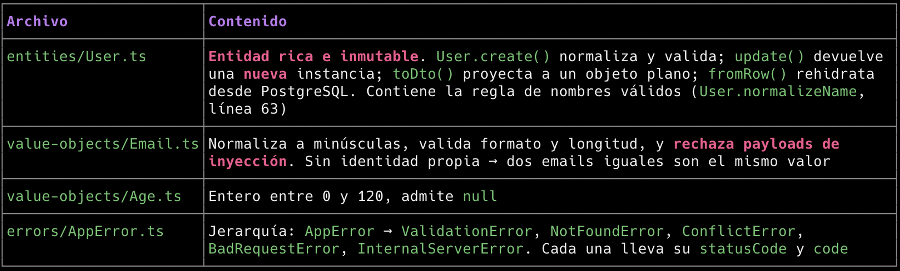
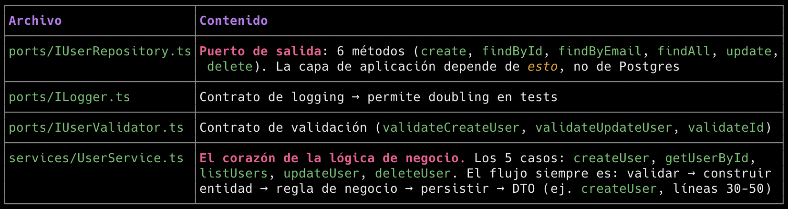
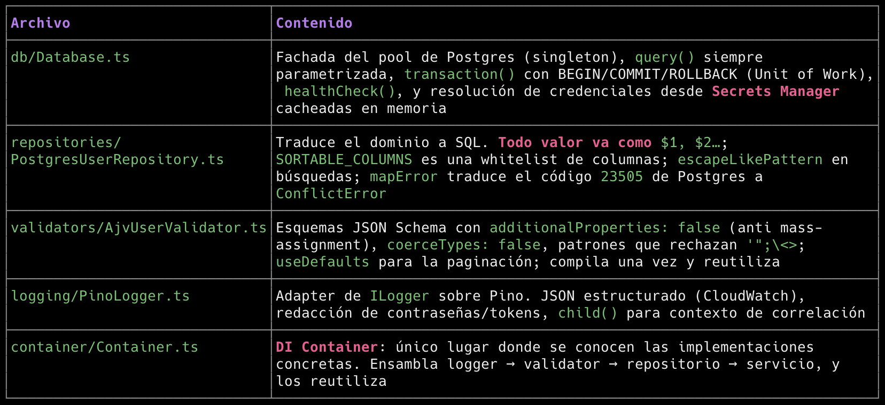
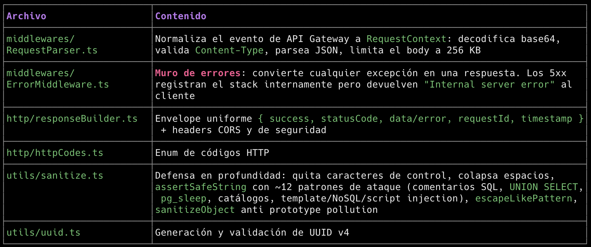

# 1.- Arquitectura del proyecto

## ¿Qué arquitectura use?

```
Arquitectura por capas con Ports & Adapters (Hexagonal), combinada con Clean Architecture simplificada. La regla que manda en todo el proyecto es una sola:
Las dependencias apuntan hacia adentro. El dominio no sabe que existe PostgreSQL, AJV ni Pino.
 ┌──────────────────────────────────────────────┐
        │  handlers/          (Adaptador HTTP)         │  API Gateway → Lambda
        │  shared/            (Utilidades)             │  parseo, errores, respuestas
        └───────────────────┬──────────────────────────┘
                            │ llama a
        ┌───────────────────▼──────────────────────────┐
        │  application/       (Casos de uso)           │  UserService
        │  ports/             (Interfaces = puertos)   │  IUserRepository, ILogger, IUserValidator
        └───────────────────┬──────────────────────────┘
                            │ depende SOLO de abstracciones
        ┌───────────────────▼──────────────────────────┐
        │  domain/             (Núcleo del negocio)    │  User, Email, Age, AppError
        │  SIN dependencias externas │
        └──────────────────────────────────────────────┘
                            ▲
        ┌───────────────────┴──────────────────────────┐
        │  infrastructure/     (Adaptadores) │  Postgres, AJV, Pino, Container
        │  implementa los puertos y se inyecta          │
        └──────────────────────────────────────────────┘
Por qué no una lambda monolítica: en un handler único todo se mezcla (parsear JSON, validar, consultar, loguear, formatear). Aquí cada archivo tiene una sola razón para cambiar y todos son testeables por separado: puedes testear UserService sin base de datos, y el repositorio sin Lambda.
```

## Patrones y SOLID Aplicados



# 2.- Estructura de carpetas y archivos

## Raíz | Archivo | Rol |

```
| template.yaml | Infraestructura como código SAM: Lambda nodejs20.x arm64, API Gateway con throttling, IAM mínimo, logs groups. Parámetros Stage, LogLevel, DbHost, DbSecretArn |
| samconfig.toml | Configuración por defecto de SAM (stack, región, capabilities) |
| Makefile | Target build-UsersFunction que invoca SAM: compila con esbuild y copia solo dist/ al artefacto |
| package.json | Scripts: build, test, test:coverage, dev, invoke, db:up/down, test:e2e |
| tsconfig.json | TS estricto: strict, noUnusedLocals, noImplicitReturns, noFallthroughCasesInSwitch |
| vitest.config.mts | Vitest + cobertura v8, excluyendo handlers y db de la métrica |
| docker-compose.yml | Postgres 16 + red sam-users-net (para que la lambda alcance users-db) + healthcheck |
| .env.example / .env | Configuración local documentada (.env está en .gitignore) |

```

## src/domain/ — el núcleo (no importa nada externo)



## src/application/ — casos de uso



## src/infrastructure/ — implementaciones concretas



## src/shared/ — transversales



## src/handlers/, src/config/, src/types/

```
- handlers/usersHandler.ts — fachada HTTP. Tabla de rutas 'GET /users' → método, ErrorMiddleware envolviendo todo, CORS/preflight, y el handler exportado que Lambda invoca. No tiene ni una regla de negocio.
- config/index.ts — lee y tipa las variables de entorno (con dotenv en local), incluida la configuración de Pino.
- types/index.ts — contratos compartidos: UserRow (snake_case de la BD), UserDto (camel_case de la API) y ListUsersQuery.
```

## tests/, scripts/, events/

```
- tests/unit/ — 95 pruebas: dominio, servicio con dobles, validador AJV (incluidos payloads maliciosos), repositorio (verificando que el SQL va parametrizado), middlewares y routing del handler.
- scripts/init-db.sql — tabla users con constraints, trigger de updated_at, índice y datos de ejemplo. Lo ejecuta Postgres al crear el contenedor.
- scripts/e2e-smoke.js — smoke test contra la BD real: CRUD + 6 vectores de ataque.
- events/*.json — eventos de API Gateway para sam local invoke (uno por método).
```

# 3. El recorrido de una petición

```
POST /users  {"firstName":"Luis","lastName":"Perez","email":"luis@test.com","age":33}
     │
 1. handler                     → crea UsersHandler desde Container (usersHandler.ts:151)
 2. RequestParser               → valida Content-Type, límite256 KB, JSON.parse
 3. tabla de rutas              → 'POST /users' ⇒ this.createUser(ctx)
 4. UserService.createUser()
 ├─ validator.validateCreateUser()   → AJV: 422 si falla (con issues por campo)
      ├─ User.create()                    → dominio: Email/Age/normalizeName
      ├─ assertEmailAvailable()           → 409 si el email existe
      └─ repository.create()
 └─ Database.query('INSERT … VALUES ($1,$2,$3,$4) RETURNING …')
 5. User.fromRow().toDto()       → entidad → objeto plano
 6. ResponseBuilder.created()    → 201 + envelope + headers de seguridad
     ※ Si algo falla en 3-5: ErrorMiddleware → status correcto, cero datos internos al cliente
```